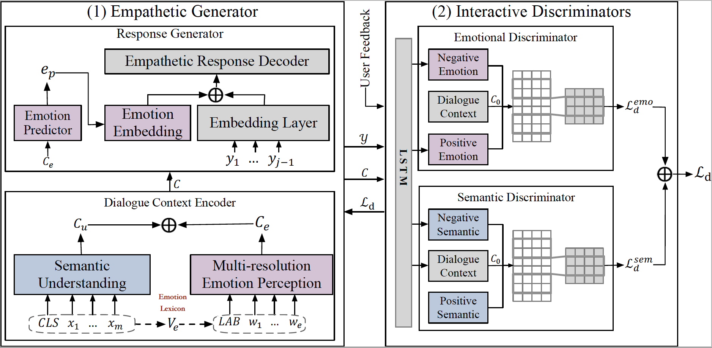

# EmpDG: Multi-resolution Interactive Empathetic Dialogue Generation (COLING 2020)
 [](https://opensource.org/licenses/MIT) 

This repository is the implementation of our COLING 2020 Paper [EmpDG: Multi-resolution Interactive Empathetic Dialogue Generation](http://128.84.4.27/pdf/1911.08698).

## Model Architecture



## Setup
- Check the packages needed or simply run the command:
```console
pip install -r requirements.txt
```
- The dataset (empathetic-dialogue) is preprocessed and stored in pickle format: 
```
.
└── empathetic-dialogue
    └── empdg_dataset_preproc.p
```
- Download GloVe vectors from [**here (glove.6B.300d.txt)**](http://nlp.stanford.edu/data/glove.6B.zip) and put it into `/vectors/`.

- For reproducibility purposes, we place the model checkpoints at [**Google Drive**](https://drive.google.com/drive/folders/1EIIZ9SFJCE1JavUal39J_NN2WxP5JK6H?usp=sharing). You could download and move it under `/result/`.

- To skip training, please check folder `/Predictions/`.


## Run code

### Training
EmpDG
```bash
# 1. Pre-train Empathetic Generator (EmpDG_woD)
# 2. Pre-train two Interactive Discriminators
# 3. Joint-train two components
python3 adver_train.py --cuda --label_smoothing --noam --emb_dim 300 --rnn_hidden_dim 300 --hidden_dim 300  --hop 1 --heads 2 --emotion_disc --pretrain_emb --model EmpDG --device_id 0 --save_path save/EmpDG/ --d_steps 1 --g_steps 5 --pointer_gen
```

EmpDG_woD
```bash
# Empathetic Generator
python train.py --cuda --label_smoothing --noam --emb_dim 300 --hidden_dim 300 --hop 1 --heads 2 --pretrain_emb --model EmpDG_woD --device_id 0 --save_path save/EmpDG_woD/ --pointer_gen
```
EmpDG_woG
```bash
# We regard the baseline EmoPrepend as generator, which only considers the coarse-grained emotional factor. 
# We only use the semantic discriminator to distinguish the generated responses and the gold ones. 

python3 adver_train_no_eg.py --cuda --label_smoothing --noam --emb_dim 300 --rnn_hidden_dim 300  --hidden_dim 300 --hop 1 --heads 2 --cuda --pretrain_emb --model EmpDG_woG --device_id 0 --save_path save/EmpDG_woG/ --d_steps 1 --g_steps 5 --pointer_gen 
```
> Add `--resume_g --resume_d` into the command to directly use the pre-trained generator or discriminator. 


### Testing
EmpDG
> Make sure that the trained model `result/EmpDG_best.tar` exists.
```bash
python3 train.py --test --model EmpDG --cuda --label_smoothing --noam --emb_dim 300 --rnn_hidden_dim 300 --hidden_dim 300  --hop 1 --heads 2 --pretrain_emb --device_id 0 --save_path save/EmpDG/ --pointer_gen
```

### Interaction
```bash
python3 interact.py --model EmpDG --cuda --label_smoothing --noam --emb_dim 300 --rnn_hidden_dim 300 --hidden_dim 300  --hop 1 --heads 2 --pretrain_emb --device_id 0 --save_path save/EmpDG/ --pointer_gen
```
* Generation examples from an interactive environment:

|Role | Response |
|---------|--------|
|User | i am so excited because i am finally going to visit my old friend ! |
|EmpDG | that is awesome ! what kind of visit ? |
|User | we will enjoy chatting and playing . |
|EmpDG | that is a lot of nostalgia . |


|Role | Response |
|---------|--------|
|User | i argued with my brother . |
|EmpDG | oh no ! what happened ? |
|User | i don't want to recall . |
|EmpDG | i am sorry , that is not a good thing .  |

## Reference & Acknowledgements
If you find our work useful, please cite our paper as follows:

```bibtex
@inproceedings{li2020empdg,
  title={EmpDG: Multi-resolution Interactive Empathetic Dialogue Generation},
  author={Li, Qintong and Chen, Hongshen and Ren, Zhaochun and Ren, Pengjie and Tu, Zhaopeng and Chen, Zhumin},
  booktitle={Proceedings of the 28th International Conference on Computational Linguistics},
  pages={4454--4466},
  year={2020}
}
```


